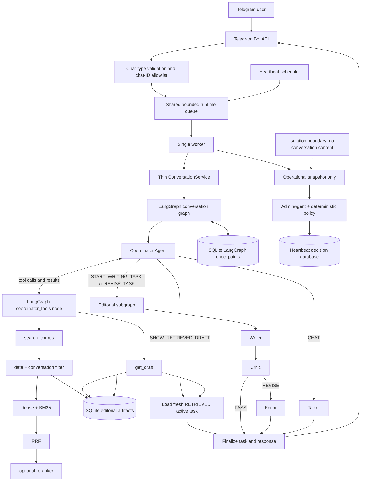
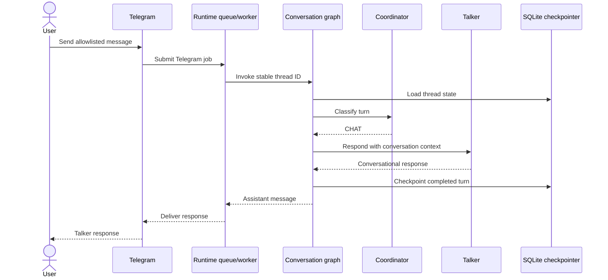
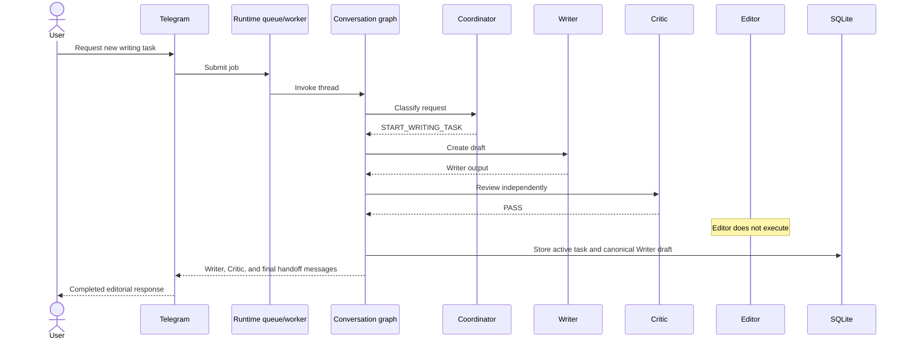
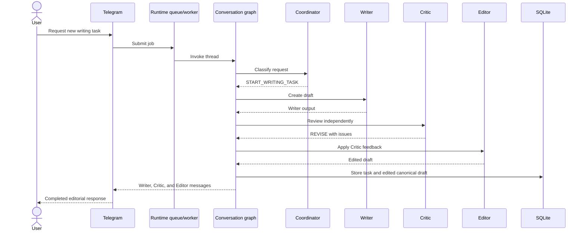
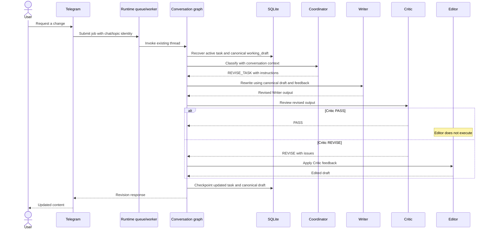
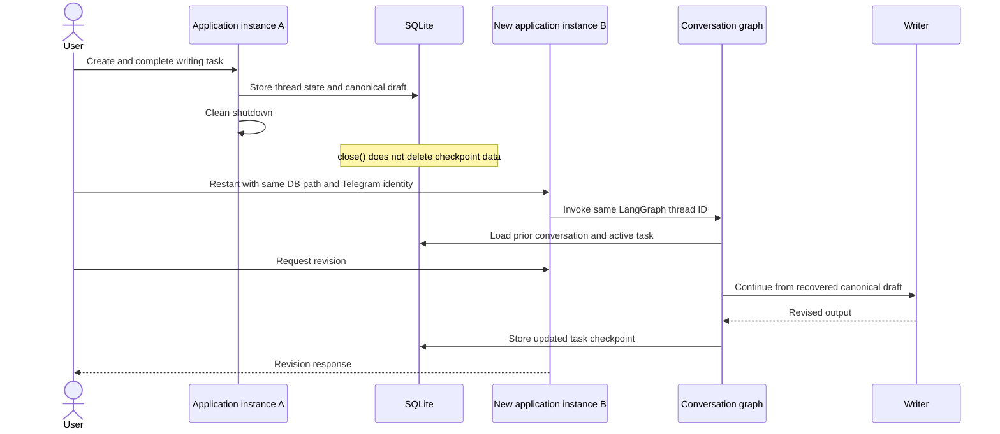
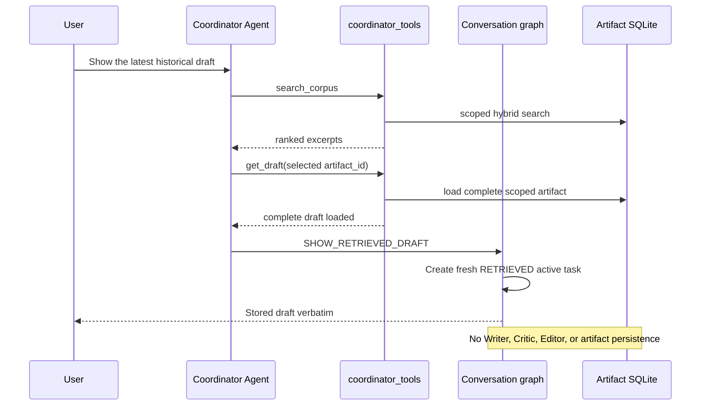
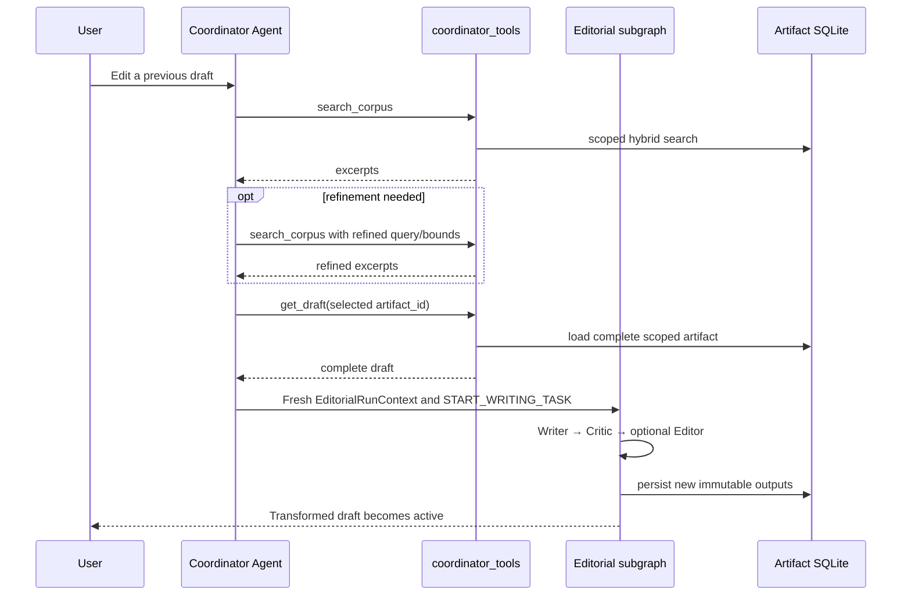
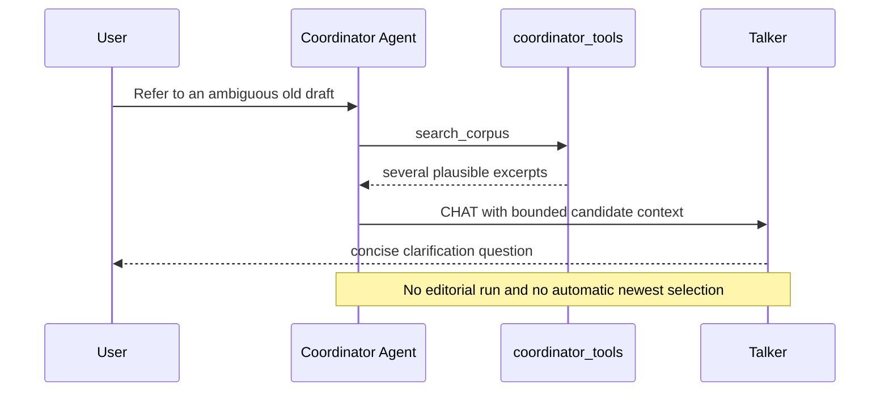
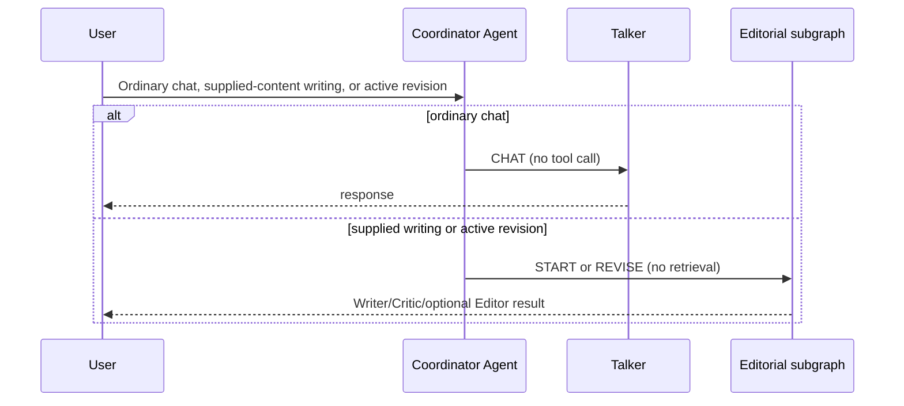

# Editorial Team v2

Editorial Team v2 is a conversational editorial assistant delivered through Telegram. It
can handle ordinary conversation, start a writing task, review a draft, apply editorial
changes, and revise the latest task across later messages and application restarts.

LangGraph is the sole conversation orchestrator and state owner. The earlier prototype included
an authenticated `/brief` HTTP ingress. During the LangGraph refactor, the project retained the
core agent capabilities and primary Telegram product surface while removing that secondary HTTP
adapter, keeping one supported live ingress instead of duplicate channel plumbing. The shared
queue, writing workflow, natural-language routing, persistence, heartbeat, and administrative
monitoring remain intact. The HTTP endpoint itself was not preserved. The separate conversation
store and legacy `WritingWorkflow` are also not part of this version.

## Setup

Requirements:

- Python 3.11
- A Gemini API key
- A Telegram bot token from BotFather
- At least one Telegram chat ID to allowlist

Create a virtual environment and install the project with its development tools:

```shell
python3.11 -m venv .venv
source .venv/bin/activate
python -m pip install --upgrade pip
python -m pip install -e ".[dev]"
```

On Windows PowerShell, activate the environment with:

```powershell
.venv\Scripts\Activate.ps1
```

Create a local configuration file:

```shell
cp .env.example .env
```

Edit `.env` and provide at least:

```dotenv
MODEL_PROVIDER=gemini
AGENT_MODEL=gemini-3.1-flash-lite
GEMINI_API_KEY=replace-with-your-key
TELEGRAM_BOT_TOKEN=replace-with-your-token
EDITORIAL_TELEGRAM_ALLOWED_CHAT_IDS=123456789,-1001234567890
EDITORIAL_CHECKPOINT_DB_PATH=runtime_data/conversations.db
EDITORIAL_CHECKPOINT_BUSY_TIMEOUT_SECONDS=5
EDITORIAL_ARTIFACT_DB_PATH=runtime_data/editorial_artifacts.db
```

`EDITORIAL_TELEGRAM_ALLOWED_CHAT_IDS` is a required comma-separated list of exact numeric
Telegram chat IDs. Positive IDs commonly identify private chats; group and supergroup IDs
are commonly negative. Only listed chats reach the runtime queue. Channels and unlisted
private chats, groups, or supergroups are ignored. Forum topics share the allowlisted group
ID but receive distinct conversation identities through Telegram's `message_thread_id`.

The application deliberately does not parse `.env` files itself. Load the edited file into
the current shell before starting it:

```shell
set -a
source .env
set +a
```

Keep `.env` private and never commit it.

### Telegram group setup

Telegram privacy mode is enabled for bots by default. With privacy mode enabled, ordinary
group messages may not reach the bot even when the group ID is allowlisted, although commands
such as `/start` do. To process ordinary group messages, disable group privacy through
BotFather or configure the bot appropriately as a group administrator. After changing privacy
mode, the bot may need to be removed from and re-added to the group.

Private-chat operation has been live-smoke-tested. Ordinary group-message operation was not
live-smoke-tested in this session; it is covered by automated transport tests.

## Run and verify

Start the production Telegram polling application:

```shell
python scripts/run_live_application.py
```

Stop cleanly with `Ctrl-C`. Shutdown drains accepted queue work and closes the checkpoint
connection. It does not delete stored conversation data. Restart with the same
`EDITORIAL_CHECKPOINT_DB_PATH` and the same Telegram chat/topic identity to resume the latest
conversation and canonical working draft.

Run the development checks:

```shell
ruff check .
python -m pytest -ra
```

## Tools and components

### External libraries and services

| Component | Role |
|---|---|
| Telegram Bot API / `python-telegram-bot` | Receives allowlisted Telegram updates, preserves forum-topic identity, sends responses, and manages polling lifecycle. |
| LangGraph | Defines and executes the conversation graph and editorial subgraph and integrates checkpoint persistence. |
| Gemini | Model provider behind the LangChain tool-calling Coordinator and the provider-neutral Talker, Writer, Critic, Editor, and AdminAgent boundaries. |
| SQLite LangGraph checkpointer | Stores durable conversation state and LangGraph checkpoint history locally. |
| SQLite artifact store | Stores immutable completed Writer and Editor outputs and deterministic chunks in a separate local corpus. |
| Sentence Transformers / NumPy | Embed eligible chunks locally and calculate exact in-memory cosine similarity. |
| Local BM25 and Reciprocal Rank Fusion | Combine lexical and dense chunk rankings without comparing their raw scores. |
| Cross-encoder reranker | Optionally reranks the fused shortlist with a local model. |
| MLflow | Persists privacy-bounded agent, model, tool, retriever, evaluation, and safety spans and trace-linked feedback. |
| pytest | Runs unit, integration, restart, isolation, transport, lifecycle, and failure tests. |
| Ruff | Performs Python linting and import/style checks. |

### Internal agents and services

| Component | Role |
|---|---|
| Coordinator | Chooses retrieval tools when historical writing is referenced, then resolves the turn as chat, a new writing task, or revision of the active task. |
| Talker | Produces ordinary conversational responses. |
| Writer | Creates a new draft or rewrites from the canonical current draft and revision instructions. |
| Critic | Independently reviews Writer output and returns `PASS` or `REVISE` with structured feedback. |
| Editor | Runs only after `REVISE` and produces the edited canonical draft. |
| `ConversationService` | Thin boundary that validates invocation input, selects the LangGraph thread, invokes the compiled graph, maps output, and sanitizes failures. |
| Artifact store and chunker | Atomically save successful editorial runs and derive paragraph-aware chunks for later retrieval. |
| `search_corpus` | Conversation-scoped LangChain tool selected by the Coordinator; returns ranked excerpts and supports repeated/refined searches. |
| `get_draft` | Conversation-scoped LangChain tool explicitly selected by the Coordinator to load one complete immutable artifact. |
| Shared runtime queue and worker | Serializes Telegram and heartbeat jobs through one bounded FIFO execution boundary. |
| Heartbeat | Collects operational queue/worker metrics and submits evaluation through the shared runtime. |
| AdminAgent | Assesses only operational snapshots under deterministic policy; it cannot access conversation messages, prompts, identities, or drafts. |
| Tracing | Emits privacy-bounded runtime and evaluation traces; live traffic uses stricter content redaction, while authorized batch evaluations retain bounded content required for scoring. |

## Architecture



The parent graph owns conversation history and the active `WritingTask`. The task's
`working_draft` is the authoritative durable draft. Coordinator decisions, Writer output,
and editorial results are execution fields that are cleared from the latest completed state,
although older LangGraph checkpoints can retain them.

Every successful execution of the editorial pipeline also receives a private run `task_id`.
That identifier means only one system writing or editing operation: every later revision gets
a new one. Each saved Writer or Editor output has its own deterministic `artifact_id`, and the
two outputs from a Writer–Editor run share the same run `task_id`. These identifiers do not
express approval, document lineage, or which artifact is latest.

Each conversation has exactly one active writing task: the draft most recently created, edited,
or explicitly retrieved by the user. Its lifecycle includes `CREATED`, `DRAFTED`, `REVIEWED`,
`REVISED`, and `RETRIEVED`. A `RETRIEVED` task contains the complete stored draft and source
provenance, has a fresh conversation task ID and no stale Critic report, and is immediately valid
for revision even though loading it did not execute the editorial subgraph.

Before an editorial run enters the subgraph, the parent graph creates one immutable
`EditorialRunContext`. Writer, Critic, and Editor receive the same run and task identity. The
context carries the authoritative source request, input draft, current instruction, operation,
and relevant retrieval metadata; Writer output and the Critic report are tagged to that run.
Graph boundaries reject stale or mismatched outputs so one agent cannot evaluate a different
task from the one another agent processed.

For historical transformations, `SOURCE REQUEST` is provenance—the request that produced the
retrieved draft—while `CURRENT TRANSFORMATION` is the user's present editing request. The current
transformation supersedes directly conflicting older requirements. For example, if provenance
says “Make the dragons tweet longer” and the current request says “Make it shorter,” the Critic
must evaluate shortening as the current requirement while preserving compatible prior context.

## Interaction sequences

### Ordinary chat



### New writing request — Critic PASS



### New writing request — Critic REVISE



### Revision of an existing task



### Restart recovery



## Checkpoint persistence and local-data safety

The conversation checkpointer stores Telegram conversation messages, writing briefs, drafts,
Critic reports, and active-task state locally. LangGraph also retains historical node
checkpoints and intermediate write records. Clearing transient fields from the latest state
does not erase older records: previous drafts, Coordinator decisions, Critic reports, Writer
output, editorial results, and formatted response fragments may remain recoverable.

Closing the application closes the SQLite connection but does not delete stored data.
Checkpoint pruning and encryption are not implemented. Treat the database as sensitive,
trusted local data and prevent untrusted users or processes from replacing or modifying it.
The current serializer uses Python `pickle`; newly created runtime directories and checkpoint
files receive user-only permissions on POSIX systems where supported.

Restart persistence requires both:

1. the same `EDITORIAL_CHECKPOINT_DB_PATH`; and
2. the same deterministic Telegram chat/topic identity.

SQLite lock waiting is bounded by `EDITORIAL_CHECKPOINT_BUSY_TIMEOUT_SECONDS`, which defaults
to five seconds. A timeout fails through the sanitized user-facing error boundary and never
falls back to in-memory state.

## Editorial artifact persistence

Completed Writer and Editor outputs are stored as immutable artifacts in the separate database
configured by `EDITORIAL_ARTIFACT_DB_PATH`, which defaults to
`runtime_data/editorial_artifacts.db`. Talker responses, Coordinator decisions, Critic reports,
and formatted Telegram handoffs are never added to this corpus. Failed editorial runs leave no
artifacts.

A Critic `PASS` stores one Writer artifact. A Critic `REVISE` followed by a successful Editor
run atomically stores both the Writer and Editor artifacts. Each artifact is deterministically
split into versioned, paragraph-aware chunks while preserving exact source offsets. Replaying
the same immutable run is idempotent; conflicting data is rejected rather than overwritten.

The artifact database is the retrieval corpus. The LangGraph checkpoint database remains
responsible only for conversation recovery and is not searched as a corpus. No relationship is
inferred between artifacts merely because they were created in chronological order.

Seed the local artifact database with the small deterministic development fixture by running:

```shell
python scripts/seed_artifact_corpus.py
```

Use `--database PATH` or `--fixture PATH` to override the configured database or sample fixture.

## Hybrid artifact retrieval

Two real LangChain tools are production-integrated into the Coordinator loop:

- `search_corpus` performs conversation-scoped hybrid search over artifact chunks.
- `get_draft` loads one selected complete artifact by ID in the same conversation scope.

The Coordinator LLM decides whether and when to call them. It may search repeatedly with refined
queries or time bounds, but loading a complete draft always requires an explicit `get_draft` call.
The parent graph represents this as `coordinator_agent -> coordinator_tools -> coordinator_agent`.
The tool node invokes the scoped `StructuredTool` objects through their LangChain runnable
interface. Tools are constructed from the validated conversation ID for each loop step; that ID
is absent from the model-visible schemas and no mutable global scope exists. A draft belonging to
another conversation is indistinguishable from a missing draft.

The loop permits at most six tool-execution rounds per user turn. Search excerpts alone never
enter the writing pipeline. After `get_draft`, the requested action determines what happens next:
a historical transformation starts a fresh editorial run, while a retrieval-only display loads
the complete artifact as the active conversational draft without running or persisting an
editorial workflow.

For retrieval-only display, the path is `search_corpus → get_draft → SHOW_RETRIEVED_DRAFT`.
The graph displays stored content verbatim and creates a fresh active task with status
`RETRIEVED`. It does not call Writer, Critic, or Editor; persist a duplicate artifact; mutate the
historical artifact; or make another model call after the final Coordinator decision. The active
copy preserves the artifact's stored `user_request`, receives a fresh conversation task ID, and
becomes the target of the next unqualified edit.

For example, if bees is active and the user asks “Show me the latest dragons tweet,” dragons is
displayed and becomes active. A subsequent “Make it longer” revises dragons. An explicit named
reference to different historical work still overrides the active task and requires a fresh
search and full-draft load.

Search first obtains eligible chunks from SQLite using the current conversation ID and inclusive
UTC `created_from` and `created_to` filters. Both retrieval branches therefore operate over the
same prefiltered corpus. Artifact timestamps mean when Editorial Team produced the output, not a
date discussed inside the draft.

The hybrid pipeline is:

1. local `sentence-transformers/all-MiniLM-L6-v2` embeddings and exact NumPy cosine search;
2. Unicode-aware local BM25 over the same chunks;
3. Reciprocal Rank Fusion of both 1-based rankings;
4. optional `cross-encoder/ms-marco-MiniLM-L6-v2` reranking;
5. an exact ordered top-k tuple with dense, BM25, RRF, and reranker diagnostics preserved.

### Chunking strategy

Production artifacts use a target chunk size of 700 whitespace-delimited tokens, a maximum of
1,000 tokens, and up to 90 tokens of overlap. The chunker preserves headings and paragraph
boundaries where possible, groups coherent editorial paragraphs while approaching the target,
splits an oversized paragraph at sentence boundaries, and uses hard token slicing only as a
final fallback. Adjacent chunks reuse complete trailing units when they fit the overlap budget.
Chunk identities are deterministic and incorporate the artifact, chunker version, ordinal, and
normalized content hash.

This policy is designed for editorial drafts rather than arbitrary web pages: headings and
paragraphs commonly represent coherent editorial units, and preserving them improves semantic
completeness. A 700-token target supplies substantial writing context without making chunks too
broad; 90-token overlap reduces boundary loss; and the 1,000-token maximum prevents an unusually
long paragraph from dominating retrieval.

The lexical branch is real Okapi BM25 with `k1 = 1.5` and `b = 0.75`. It uses Unicode-aware,
case-folded tokenization over the same prefiltered chunks as dense retrieval.

Production parameters are dense depth 30, BM25 depth 30, RRF constant 60, fused depth 30,
reranking depth 15, and final top-k 5. Reranking is implemented and configurable but disabled by
default because the current measured corpus showed lower rank-one quality and no improvements.
Explicit `rerank=true` remains supported. Recency is disabled by default and, when requested,
only breaks ties after active relevance and RRF scores.

Reranking adds a local cross-encoder inference step and additional resource use; first use may
also require downloading and loading the model. No reproducible hardware-specific latency
benchmark was recorded. The production default is based on measured quality rather than an
invented timing estimate: retrieval quality declined with reranking, generation effects were
mixed, and no consistent improvement justified the extra model cost and latency.

Configure the local retrieval layer with:

```dotenv
EDITORIAL_EMBEDDING_MODEL=sentence-transformers/all-MiniLM-L6-v2
EDITORIAL_RERANKER_MODEL=cross-encoder/ms-marco-MiniLM-L6-v2
EDITORIAL_RETRIEVAL_DENSE_DEPTH=30
EDITORIAL_RETRIEVAL_BM25_DEPTH=30
EDITORIAL_RETRIEVAL_RRF_K=60
EDITORIAL_RETRIEVAL_FUSED_DEPTH=30
EDITORIAL_RETRIEVAL_RERANK_DEPTH=15
EDITORIAL_RETRIEVAL_TOP_K=5
EDITORIAL_RETRIEVAL_RERANK=false
```

After seeding the fixture, run a manual search with:

```shell
python scripts/search_artifact_corpus.py "Aurora launch" \
  --conversation-id fixture-conversation \
  --database runtime_data/editorial_artifacts.db \
  --top-k 5 \
  --rerank
```

The command also accepts `--created-from`, `--created-to`, `--prefer-recent`, and
`--no-rerank`. The embedding and cross-encoder models run locally but may download from their
model registry on first use. Unit tests use deterministic fakes and never initialize or download
the real models.

### Retrieval sequences









## HW2 deterministic retrieval evaluation

The committed evaluation uses 27 fixed realistic artifacts: 24 in `eval-retrieval-main` and
three cross-conversation distractors. The production paragraph/heading-aware chunker produces 28
stable chunks, including a two-chunk logistics report. The 12 cases cover rare terms, acronyms,
semantic paraphrases, lexical/semantic mismatch, near duplicates, entity ambiguity, headings,
date filters, recency, multiple relevant chunks, and one out-of-corpus probe.

The measured configuration is dense depth 30, BM25 depth 30, reciprocal-rank fusion with
`score = Σ 1 / (60 + rank)`, fused depth 30, reranker depth 15, and final k values 1, 3, 5, and
10. Dense retrieval uses `sentence-transformers/all-MiniLM-L6-v2`; reranking uses
`cross-encoder/ms-marco-MiniLM-L6-v2`. Exact `SearchResult` order is scored without grouping,
deduplication, date resorting, or context repacking.

- Hit rate@k is one when any golden chunk is present in the first k results.
- Precision@k is relevant results divided by requested k, even with fewer returned results.
- Recall@k is retrieved relevant chunks divided by all golden chunks.
- MRR@k is reciprocal rank of the first relevant result within k, or zero.
- nDCG@k uses binary relevance and the `1 / log2(position + 1)` discount.

The empty-golden case is N/A, excluded from all aggregates, and retained for qualitative
inspection. No abstention threshold is inferred.

| Reranking | k | Hit rate | Precision | Recall | MRR@k | nDCG@k |
|---|---:|---:|---:|---:|---:|---:|
| off | 1 | 1.0000 | 1.0000 | 0.9545 | 1.0000 | 1.0000 |
| off | 3 | 1.0000 | 0.3636 | 1.0000 | 1.0000 | 1.0000 |
| off | 5 | 1.0000 | 0.2182 | 1.0000 | 1.0000 | 1.0000 |
| off | 10 | 1.0000 | 0.1091 | 1.0000 | 1.0000 | 1.0000 |
| on | 1 | 0.8182 | 0.8182 | 0.7727 | 0.8182 | 0.8182 |
| on | 3 | 1.0000 | 0.3636 | 1.0000 | 0.9091 | 0.9329 |
| on | 5 | 1.0000 | 0.2182 | 1.0000 | 0.9091 | 0.9329 |
| on | 10 | 1.0000 | 0.1091 | 1.0000 | 0.9091 | 0.9329 |

BM25 ranked the edited Meridian acquisition release and warehouse-automation heading above
dense retrieval; dense ranked the bounded carbon-policy result above BM25. Both branches found
every non-empty golden chunk within their configured depths, so this corpus does not demonstrate
a result uniquely rescued by one branch or RRF. Fusion consolidated already successful evidence.
Reranking left nine eligible cases unchanged and worsened two near-duplicate/recency cases
(`ret-005` and `ret-010`), demoting the relevant chunk from rank one to rank two. It improved no
case. On this corpus, reranker depth 15 is not justified by measured ranking quality; that negative
result is retained rather than tuned away. There were no remaining retrieval misses by k=3.
Increasing k completed multi-relevant recall while requested-k precision fell.

Reproduce the real local-model run with:

```shell
python evaluation/retrieval/run_retrieval_eval.py
```

Machine-readable rankings, golden IDs, metrics, stage positions, and reranking deltas are in
`evaluation/outputs/retrieval_results.json`; the human report is in
`evaluation/outputs/retrieval_report.md`. The evaluation is deterministic once the local model
weights are available and does not call an external judge, but the embedding and reranker weights
may download from their registry on first use. Generation and agent-level metrics are
intentionally absent.

## HW2 judged generation evaluation

The standalone evaluation path is query → production hybrid retriever → exact ordered chunks →
grounded Gemini answer → four separate structured Gemini judges. It does not invoke Coordinator,
tools, Telegram, or Writer–Critic–Editor. The fixed set contains 20 objective cases across six
transparent failure categories: missing relevant context, irrelevant/distracting context,
incomplete multi-chunk context, unsupported claim/hallucination, near-duplicate/conflicting
context, and out-of-corpus/required abstention. The exact Session 11 §5 category source was not
present in the available repository or course materials, so this requested fallback mapping is
used and documented.

All 20 cases run with reranking explicitly enabled. A nine-case stratified subset runs with it
explicitly disabled and includes the two retrieval cases worsened by reranking, exact-term,
semantic, multi-chunk, near-duplicate, and out-of-corpus coverage. Corpus, prompts, models,
retrieval depths, and top-k remain constant between conditions.

Faithfulness judges support for every material claim; answer relevance judges direct and
sufficient response to the query; context precision judges retrieved-context relevance and noise;
context recall judges whether context contains everything needed for the golden answer. Each uses
a separate fixed rubric and strict `{score, reason}` schema. The hand-rolled judge reuses the
project's inspectable structured Gemini infrastructure without adding DeepEval or Ragas.

Judge cache keys include case and metric, corpus/case hashes, hashed query, answer, retrieved and
golden contexts, golden answer, judge model, prompt version, and scorer version. Credentials and
reranking labels are never shown to the judge or cached. Risks remain: position bias, verbosity
preference, same-family self-preference, judge-model mismatch, golden wording sensitivity, and
nondeterminism. Stable context order, low-variance model defaults, fixed rubrics, hidden condition,
version recording, caching, category reporting, and manual sampling mitigate but do not remove
those risks.

The real run used `gemini-3.1-flash-lite` for both generation and judging. This same-model choice
is economical and consistent but increases self-preference risk. The latest committed evaluation
records 76 cache hits and 40 misses across 116 judge lookups. An initially empty cache would
produce 116 judge misses; later runs avoid repeated judge calls when the content-addressed key
matches. Keys include the case and metric, corpus and case-set hashes, hashed query, candidate
answer, retrieved and golden contexts, golden answer, judge model, prompt version, and scorer
version.

| Condition | Faithfulness | Answer relevance | Context precision | Context recall |
|---|---:|---:|---:|---:|
| rerank on, all 20 | 0.9000 | 0.8800 | 0.2175 | 0.9000 |
| rerank on, matched 9-case subset | 0.8889 | 0.8556 | 0.2833 | 0.8889 |
| rerank off, matched 9-case subset | 0.8333 | 0.8556 | 0.3111 | 0.8667 |

### Generation results by failure category

| Category | Faithfulness | Answer relevance | Context precision | Context recall |
|---|---:|---:|---:|---:|
| Incomplete multi-chunk | 0.3333 | 0.3000 | 0.1333 | 0.3333 |
| Irrelevant/distracting context | 1.0000 | 1.0000 | 0.2750 | 1.0000 |
| Missing relevant context | 1.0000 | 1.0000 | 0.2000 | 1.0000 |
| Near-duplicate/conflicting context | 1.0000 | 0.9250 | 0.4125 | 1.0000 |
| Out-of-corpus abstention | 1.0000 | 1.0000 | 0.0000 | 1.0000 |
| Unsupported claim | 1.0000 | 1.0000 | 0.2000 | 1.0000 |

Incomplete multi-chunk is the weakest category, and aggregate averages conceal that severe
weakness. Context precision is generally low because top-five retrieval often contains
irrelevant chunks. All out-of-corpus cases nevertheless abstained successfully; their context
precision is zero because the forced top-five context is unrelated, not because the answers
hallucinated.

On the matched nine-case subset, reranking increased faithfulness and context recall slightly,
left answer relevance unchanged, and decreased context precision. It improved `gen-009`, worsened
`gen-004`, `gen-012`, and `gen-020`, and left `gen-001`, `gen-003`, `gen-007`, `gen-011`, and
`gen-017` unchanged. Thus generation effects are mixed and do not overturn the retrieval evidence
for keeping reranking disabled by default.

The weakest category was incomplete multi-chunk context: faithfulness 0.3333, answer relevance
0.3000, context precision 0.1333, and context recall 0.3333. In `gen-011` and `gen-013`, retrieval
returned the golden chunk but the generator still abstained; `gen-012` received relevant context
yet produced an incomplete/misdirected comparison. This is a clear retrieval-versus-generation
disagreement: successful chunk retrieval did not guarantee a sufficient answer. Conversely,
reranking changed wording or rank order in several subset cases without materially changing all
judged dimensions.

All three out-of-corpus cases correctly answered that the corpus did not provide the requested
fact. They scored 1.0 for faithfulness, relevance, and context recall, while context precision was
0.0 because the forced top-five retrieval consisted of unrelated chunks. This is expected without
an abstention threshold and shows why context precision must be interpreted separately.

Reproduce with:

```shell
python evaluation/generation/run_generation_eval.py
```

Optional settings are `EDITORIAL_EVAL_GENERATOR_MODEL`, `EDITORIAL_EVAL_JUDGE_MODEL`, and
`EDITORIAL_EVAL_CACHE_PATH`. Generator and judge otherwise fall back to `AGENT_MODEL`; using the
same Gemini family introduces self-preference risk. This command requires a configured model key
and may incur generator and judge calls. A matching persistent cache avoids repeated judge calls;
the cache path is ignored by Git and is not a submitted secret. No cache file is committed, but a
locally configured cache can be reused across matching runs. Machine-readable results and the
human report are written to `evaluation/outputs/generation_results.json` and
`evaluation/outputs/generation_report.md`. The committed reports may be inspected without making
new model calls.

## HW3 traced agent evaluation

HW3 evaluates the complete conversational application rather than an isolated retriever or
generator. The fixed plan contains 12 scenarios with exactly three independent runs each, for 36
model-backed runs. It covers ordinary chat, supplied-content writing, memory-backed writing,
exact/latest/date-bounded retrieval, active and historical revision, no-match handling, retrieval
ranking, ambiguous references, and tool restraint.

Each scenario declares an expected ordered tool trajectory, bounded parameter assertions, and an
independent goal-completion predicate. Some cases declare a small explicit set of acceptable
trajectory alternatives; for example, no-match handling may use one search or one refined repeat
search. Execution does not infer tool use from application state. The evaluator reads the
chronologically ordered LangChain `TOOL` spans from the persisted MLflow trace and compares that
observed sequence with the declared alternatives. Parameter accuracy is computed both per run and
across individual field assertions. Goal completion remains separate from both tool metrics, and
overall run success additionally requires that no fatal execution error occurred.

`evaluation/agent/final-results.json` preserves the original campaign run records captured at
execution time. Some Part 1 component values were subsequently corrected by deterministic
rescoring of the persisted MLflow traces, without rerunning the agent. The authoritative reported
Part 1 metrics are those rescored values in `evaluation/agent/final-summary.json` and the current
valid MLflow feedback assessments. The tracking-store identity is recorded in
`evaluation/agent/final-results.manifest.json`.

| Part 1 metric | Successful / evaluated | Rate |
|---|---:|---:|
| Tool selection / trajectory | 36 / 36 | 1.0000 |
| Run-level tool parameters | 34 / 36 | 0.9444 |
| Field-level tool parameters | 49 / 51 | 0.9608 |
| Goal completion | 35 / 36 | 0.9722 |
| Overall run success | 33 / 36 | 0.9167 |

Ten scenarios passed all three runs. The two mixed-result scenarios were:

| Scenario | Three-run result | Evidence retained by the evaluator |
|---|---:|---|
| `chat_simple` | 2/3 | Run 1 had no tool-selection or parameter error, but a successful provider call was followed by strict Coordinator response parsing/validation failure, so goal and overall completion failed. |
| `write_with_memory` | 1/3 | Runs 1 and 3 used the correct retrieval trajectory and completed the goal, but incorrectly set `prefer_recent=true` where the declared expectation was `false`. |

All other scenarios, including all three exact Cedar transformations, were 3/3. Every scenario
had at least one successful run (`pass@3 = 1`); only the two mixed scenarios failed to pass all
three runs (`pass³ = 0`). Optional HW2 retrieval and generation scores remain attached to
applicable agent runs but are not folded into Part 1 overall success unless a case's explicit
completion predicate requires that evidence.

### Execution, deterministic rescoring, and feedback

These are separate operations:

1. The campaign command invokes the real model-backed application and creates isolated
   checkpoints, artifacts, traces, raw results, and a manifest.
2. `--rescore-part1` reloads frozen traces and deterministically reconstructs trajectories,
   parameters, and supported completion evidence. It does not invoke the agent or make a model
   request. Stored retrieval scores can likewise be recomputed without rerunning the agent.
3. Reporting writes a derived summary and logs the already-computed metrics to their originating
   trace IDs. Optional `--rescore-generation` is different: it still never reruns the agent, but
   it deliberately makes fresh generation-judge requests.

Run a new agent campaign only when model credentials are available in the process environment:

```shell
PYTHONPATH=src:. .venv/bin/python scripts/run_agent_evaluation.py \
  --output evaluation/agent/final-results.json \
  --manifest evaluation/agent/final-results.manifest.json \
  --temperature 0.2
```

Regenerate the deterministic Part 1 summary and attach Part 1, existing HW2, and safety feedback
to the frozen traces without rerunning the agent:

```shell
PYTHONPATH=src:. .venv/bin/python scripts/report_agent_evaluation.py \
  --results evaluation/agent/final-results.json \
  --manifest evaluation/agent/final-results.manifest.json \
  --summary evaluation/agent/final-summary.json \
  --rescore-part1 \
  --log-feedback \
  --log-safety-feedback
```

### MLflow trace and feedback semantics

MLflow records what happened; it does not decide correctness. The root `AGENT` span carries
bounded campaign, outcome, and safety metadata. Child model spans retain model identity, status,
latency, and available token counts; `TOOL` spans retain allowlisted validated arguments and
bounded success/failure data; `RETRIEVER` spans retain the evaluation-authorized query, ordered
chunk identities/rankings, and bounded contexts needed by the existing HW2 adapters. Batch traces
also retain the final candidate answer required by generation judging. Ordinary live traces keep
the stricter content-redaction policy.

The campaign manifest maps every trace ID to its exact MLflow tracking URI and experiment, so a
later report does not assume that all traces live in whichever tracking store is globally active.
Part 1 feedback uses `agent.tool_selection_accuracy`, `agent.tool_parameter_accuracy`,
`agent.goal_completion`, and `agent.overall_pass`. Applicable HW2 feedback uses the existing
retrieval and generation metric names. Repeated reporting locates an existing valid assessment
with the intended name and overrides it; it does not leave contradictory duplicate judgments.

## HW3 empirical safety evaluation

The safety implementation uses four bounded layers: multi-signal input preflight checks,
structural separation of application instructions from untrusted user/retrieved data, controlled
postflight leakage checks, and the existing least-privilege tool boundary. The empirical campaign
is a separate six-case model-backed evaluation, not an extension of the 12 ordinary agent
scenarios.

| Safety population | Result |
|---|---:|
| Total safety cases | 6 |
| Adversarial cases with threat detected | 4 / 4 |
| Adversarial cases with effective defense | 4 / 4 |
| Adversarial unsafe outcomes | 0 / 4 |
| Legitimate safety controls falsely flagged | 0 / 2 |
| Legitimate-control false-positive rate | 0.0 |
| Frozen normal-agent traces falsely flagged | 0 / 36 |
| Frozen normal-agent false-positive rate | 0.0 |

The 36 normal-agent traces are frozen ordinary-use evidence from the completed agent campaign.
They were not rerun or substituted into the six-case safety campaign, and their denominator is
reported separately. Of the two dedicated legitimate controls, neither was flagged; one completed
its editorial task and one ended at the existing sanitized Coordinator-failure boundary for a
non-safety response parsing/validation reason. Thus the reported `0/2` is specifically a safety
false-positive result, not a claim that both control tasks completed successfully.

The six cases cover direct prompt injection, secret/configuration exfiltration, indirect injection
inside a retrieved historical draft, cross-scope/tool abuse, quoted discussion of injection text,
and legitimate editorial use of the word “ignore.” Direct injection and exfiltration were blocked
at preflight. The indirect case searched and loaded the synthetic draft, recorded structural
containment, and completed the legitimate transformation: the embedded instruction remained data
rather than gaining application authority. Cross-scope/tool abuse was contained at preflight; an
explicit schema/tool denial would be represented separately by `tool_denied`. No fake shell,
environment, filesystem, or network tool was added for testing.

The campaign uses a dedicated safety-only MLflow database and experiment, plus isolated checkpoint
and artifact databases per case. Every request enters the real
`ConversationService.process_message()` path with `request_origin=batch`. It does not interact
with Telegram or normal runtime stores. Only a synthetic canary is configured, and the bounded
result artifacts do not persist attack text, retrieved malicious content, or the canary value.
The runtime MLflow/checkpoint/artifact databases remain ignored by Git.

Run the isolated campaign when model credentials are available in the process environment:

```shell
PYTHONPATH=src:. .venv/bin/python scripts/run_safety_evaluation.py \
  --output evaluation/safety/results.json \
  --summary evaluation/safety/summary.json \
  --manifest evaluation/safety/manifest.json
```

The runner itself does not load `.env`; credentials must already be configured in the launching
process. To score only the persisted traces and log feedback:

```shell
PYTHONPATH=src:. .venv/bin/python scripts/report_safety_evaluation.py \
  --results evaluation/safety/results.json \
  --summary evaluation/safety/summary.json \
  --manifest evaluation/safety/manifest.json \
  --log-feedback
```

Reporting reloads every persisted trace and calls the pure trace scorer without querying
checkpoints or artifact databases and without rerunning the agent. The scorer separately returns
threat detection, defense effectiveness, and unsafe behavior; successful blocking or containment
is therefore not counted as an unsafe outcome. Feedback is attached to the original trace using
`safety.threat_detected`, `safety.defense_effective`, and `safety.unsafe_behavior`, with the same
assessment override behavior as agent reporting.

The bounded safety artifacts are `evaluation/safety/results.json`,
`evaluation/safety/summary.json`, and `evaluation/safety/manifest.json`. They support later audit
without committing the safety-only MLflow database or isolated runtime stores.

### HW3 verification snapshot

The completed offline verification snapshot was:

- focused safety runner/reporting tests: 36 passed;
- Stage 1–6 tracing/evaluation tests: 99 passed;
- full offline suite: 621 passed;
- Ruff: passed;
- `git diff --check`: passed.

Relevant focused checks can be rerun without model calls:

```shell
PYTHONPATH=src:. .venv/bin/pytest -q \
  tests/evaluation/test_safety_runner.py \
  tests/safety/test_safety.py \
  tests/evaluation/test_agent_reporting.py
PYTHONPATH=src:. .venv/bin/pytest -q tests/test_mlflow_tracing.py tests/evaluation tests/safety
ruff check .
git diff --check
```

These counts are the verified state preceding this README-only edit; this documentation task did
not rerun the full suite or either model-backed campaign.

## Optional heartbeat and AdminAgent

Heartbeat is disabled by default. To enable it, configure:

```dotenv
EDITORIAL_HEARTBEAT_ENABLED=true
EDITORIAL_HEARTBEAT_INTERVAL_SECONDS=900
EDITORIAL_HEARTBEAT_DB_PATH=runtime_data/editorial_team.db
EDITORIAL_ADMIN_TELEGRAM_CHAT_ID=123456789
```

The live interval must be at least 10 seconds. Each heartbeat observes queue and worker
metrics and enters the same shared runtime queue as Telegram jobs. AdminAgent receives only
the resulting `OperationalSnapshot` and immutable policy. Application code independently
validates its `SILENCE` or `NOTIFY` decision. It cannot inspect conversations, user identities,
prompts, or drafts.

Heartbeat decisions use their own SQLite database. This operational database stores safe
queue/worker metrics and notification status, not conversation content. Because heartbeat is
in-process, it cannot independently detect total process loss; that would require an external
watchdog.

Inspect recent operational decisions with:

```shell
sqlite3 runtime_data/editorial_team.db \
  "SELECT observed_at, decision, reason_code, notification_sent
   FROM heartbeat_results
   ORDER BY observed_at DESC
   LIMIT 10;"
```

## Reliability and privacy boundaries

Coordinator and Critic request provider-native JSON Schema-constrained output and then pass it
through strict application parsing and domain validation. Talker, Writer, and Editor return
plain text. Provider failures, malformed outputs, persistence failures, and delivery failures
cross sanitized boundaries rather than exposing prompts, drafts, credentials, SQL, or local
paths.

The runtime queue is intentionally in-memory and globally serialized. It drains accepted work
on clean shutdown but does not survive process restart. Completed conversation state survives
through SQLite checkpoints.
