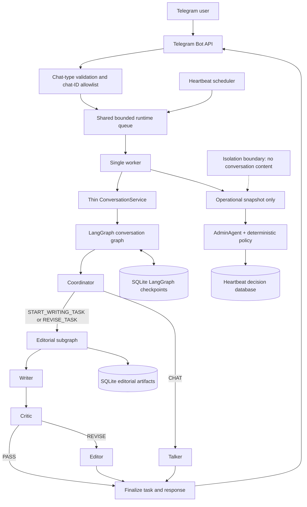
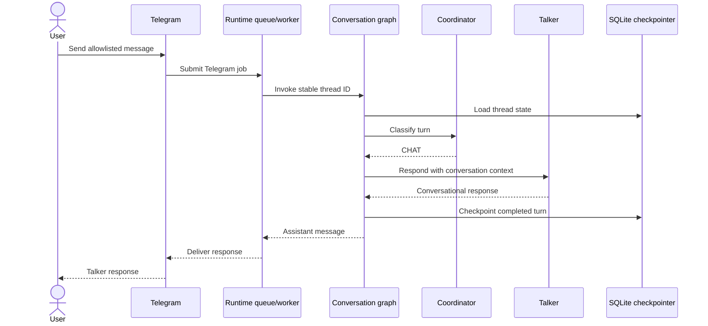
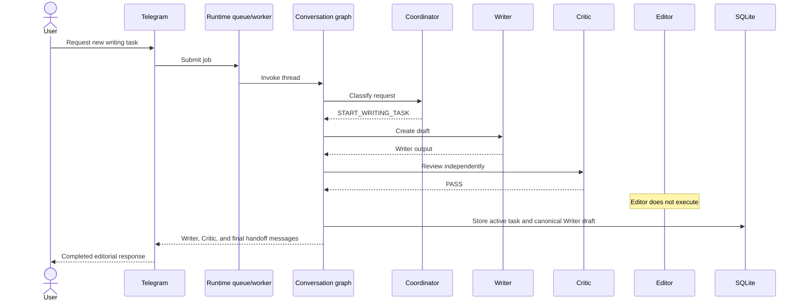
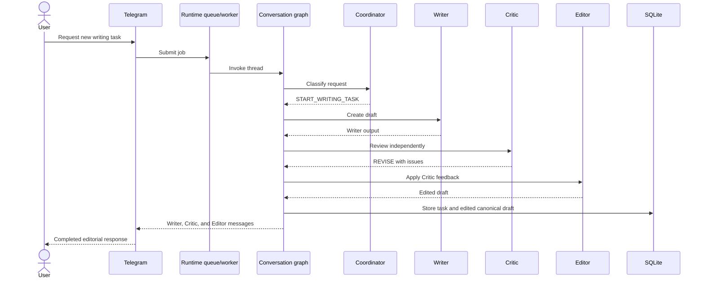
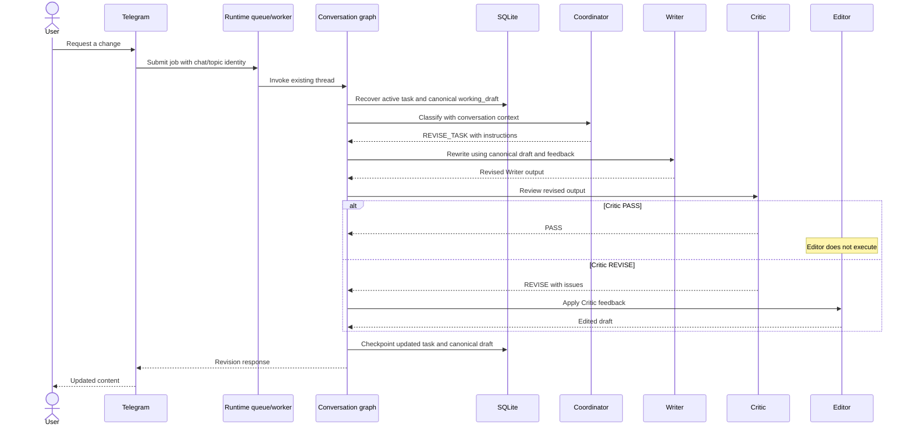
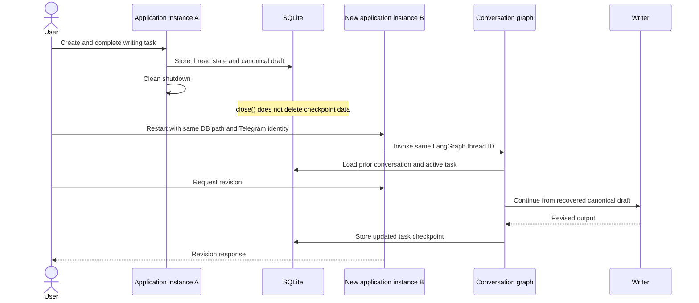

# Editorial Team v2

Editorial Team v2 is a conversational editorial assistant delivered through Telegram. It
can handle ordinary conversation, start a writing task, review a draft, apply editorial
changes, and revise the latest task across later messages and application restarts.

LangGraph is the sole conversation orchestrator and state owner. The retired REST `/brief`
interface, separate conversation store, and legacy `WritingWorkflow` are not part of this
version.

## Setup

Requirements:

- Python 3.11
- A Gemini API key
- A Telegram bot token from BotFather
- At least one Telegram chat ID to allowlist

Create a virtual environment and install the project with its development tools:

```shell
python3.11 -m venv .venv
source .venv/bin/activate
python -m pip install --upgrade pip
python -m pip install -e ".[dev]"
```

On Windows PowerShell, activate the environment with:

```powershell
.venv\Scripts\Activate.ps1
```

Create a local configuration file:

```shell
cp .env.example .env
```

Edit `.env` and provide at least:

```dotenv
MODEL_PROVIDER=gemini
AGENT_MODEL=gemini-3.1-flash-lite
GEMINI_API_KEY=replace-with-your-key
TELEGRAM_BOT_TOKEN=replace-with-your-token
EDITORIAL_TELEGRAM_ALLOWED_CHAT_IDS=123456789,-1001234567890
EDITORIAL_CHECKPOINT_DB_PATH=runtime_data/conversations.db
EDITORIAL_CHECKPOINT_BUSY_TIMEOUT_SECONDS=5
EDITORIAL_ARTIFACT_DB_PATH=runtime_data/editorial_artifacts.db
```

`EDITORIAL_TELEGRAM_ALLOWED_CHAT_IDS` is a required comma-separated list of exact numeric
Telegram chat IDs. Positive IDs commonly identify private chats; group and supergroup IDs
are commonly negative. Only listed chats reach the runtime queue. Channels and unlisted
private chats, groups, or supergroups are ignored. Forum topics share the allowlisted group
ID but receive distinct conversation identities through Telegram's `message_thread_id`.

The application deliberately does not parse `.env` files itself. Load the edited file into
the current shell before starting it:

```shell
set -a
source .env
set +a
```

Keep `.env` private and never commit it.

### Telegram group setup

Telegram privacy mode is enabled for bots by default. With privacy mode enabled, ordinary
group messages may not reach the bot even when the group ID is allowlisted, although commands
such as `/start` do. To process ordinary group messages, disable group privacy through
BotFather or configure the bot appropriately as a group administrator. After changing privacy
mode, the bot may need to be removed from and re-added to the group.

Private-chat operation has been live-smoke-tested. Ordinary group-message operation was not
live-smoke-tested in this session; it is covered by automated transport tests.

## Run and verify

Start the production Telegram polling application:

```shell
python scripts/run_live_application.py
```

Stop cleanly with `Ctrl-C`. Shutdown drains accepted queue work and closes the checkpoint
connection. It does not delete stored conversation data. Restart with the same
`EDITORIAL_CHECKPOINT_DB_PATH` and the same Telegram chat/topic identity to resume the latest
conversation and canonical working draft.

Run the development checks:

```shell
ruff check .
python -m pytest -ra
```

## Tools and components

### External libraries and services

| Component | Role |
|---|---|
| Telegram Bot API / `python-telegram-bot` | Receives allowlisted Telegram updates, preserves forum-topic identity, sends responses, and manages polling lifecycle. |
| LangGraph | Defines and executes the conversation graph and editorial subgraph and integrates checkpoint persistence. |
| Gemini | Model provider behind the provider-neutral Coordinator, Talker, Writer, Critic, Editor, and AdminAgent boundaries. |
| SQLite LangGraph checkpointer | Stores durable conversation state and LangGraph checkpoint history locally. |
| SQLite artifact store | Stores immutable completed Writer and Editor outputs and deterministic chunks in a separate local corpus. |
| Sentence Transformers / NumPy | Embed eligible chunks locally and calculate exact in-memory cosine similarity. |
| Local BM25 and Reciprocal Rank Fusion | Combine lexical and dense chunk rankings without comparing their raw scores. |
| Cross-encoder reranker | Optionally reranks the fused shortlist with a local model. |
| pytest | Runs unit, integration, restart, isolation, transport, lifecycle, and failure tests. |
| Ruff | Performs Python linting and import/style checks. |

### Internal agents and services

| Component | Role |
|---|---|
| Coordinator | Classifies each turn as ordinary chat, a new writing task, or revision of the active task. |
| Talker | Produces ordinary conversational responses. |
| Writer | Creates a new draft or rewrites from the canonical current draft and revision instructions. |
| Critic | Independently reviews Writer output and returns `PASS` or `REVISE` with structured feedback. |
| Editor | Runs only after `REVISE` and produces the edited canonical draft. |
| `ConversationService` | Thin boundary that validates invocation input, selects the LangGraph thread, invokes the compiled graph, maps output, and sanitizes failures. |
| Artifact store and chunker | Atomically save successful editorial runs and derive paragraph-aware chunks for later retrieval. |
| `search_corpus` | Conversation-scoped LangChain tool returning ranked chunk excerpts and retrieval diagnostics. |
| `get_draft` | Conversation-scoped LangChain tool returning one selected complete immutable artifact. |
| Shared runtime queue and worker | Serializes Telegram and heartbeat jobs through one bounded FIFO execution boundary. |
| Heartbeat | Collects operational queue/worker metrics and submits evaluation through the shared runtime. |
| AdminAgent | Assesses only operational snapshots under deterministic policy; it cannot access conversation messages, prompts, identities, or drafts. |
| Tracing | Emits correlation-safe stage and runtime metadata without logging product content or secrets. |

## Architecture



The parent graph owns conversation history and the active `WritingTask`. The task's
`working_draft` is the authoritative durable draft. Coordinator decisions, Writer output,
and editorial results are execution fields that are cleared from the latest completed state,
although older LangGraph checkpoints can retain them.

Every successful execution of the editorial pipeline also receives a private run `task_id`.
That identifier means only one system writing or editing operation: every later revision gets
a new one. Each saved Writer or Editor output has its own deterministic `artifact_id`, and the
two outputs from a Writer–Editor run share the same run `task_id`. These identifiers do not
express approval, document lineage, or which artifact is latest.

## Interaction sequences

### Ordinary chat



### New writing request — Critic PASS



### New writing request — Critic REVISE



### Revision of an existing task



### Restart recovery



## Checkpoint persistence and local-data safety

The conversation checkpointer stores Telegram conversation messages, writing briefs, drafts,
Critic reports, and active-task state locally. LangGraph also retains historical node
checkpoints and intermediate write records. Clearing transient fields from the latest state
does not erase older records: previous drafts, Coordinator decisions, Critic reports, Writer
output, editorial results, and formatted response fragments may remain recoverable.

Closing the application closes the SQLite connection but does not delete stored data.
Checkpoint pruning and encryption are not implemented. Treat the database as sensitive,
trusted local data and prevent untrusted users or processes from replacing or modifying it.
The current serializer uses Python `pickle`; newly created runtime directories and checkpoint
files receive user-only permissions on POSIX systems where supported.

Restart persistence requires both:

1. the same `EDITORIAL_CHECKPOINT_DB_PATH`; and
2. the same deterministic Telegram chat/topic identity.

SQLite lock waiting is bounded by `EDITORIAL_CHECKPOINT_BUSY_TIMEOUT_SECONDS`, which defaults
to five seconds. A timeout fails through the sanitized user-facing error boundary and never
falls back to in-memory state.

## Editorial artifact persistence

Completed Writer and Editor outputs are stored as immutable artifacts in the separate database
configured by `EDITORIAL_ARTIFACT_DB_PATH`, which defaults to
`runtime_data/editorial_artifacts.db`. Talker responses, Coordinator decisions, Critic reports,
and formatted Telegram handoffs are never added to this corpus. Failed editorial runs leave no
artifacts.

A Critic `PASS` stores one Writer artifact. A Critic `REVISE` followed by a successful Editor
run atomically stores both the Writer and Editor artifacts. Each artifact is deterministically
split into versioned, paragraph-aware chunks while preserving exact source offsets. Replaying
the same immutable run is idempotent; conflicting data is rejected rather than overwritten.

The artifact database is the future retrieval corpus. The LangGraph checkpoint database remains
responsible only for conversation recovery and is not searched as a corpus. No relationship is
inferred between artifacts merely because they were created in chronological order.

Seed the local artifact database with the small deterministic development fixture by running:

```shell
python scripts/seed_artifact_corpus.py
```

Use `--database PATH` or `--fixture PATH` to override the configured database or sample fixture.

## Hybrid artifact retrieval

Two real LangChain tools are implemented for the next conversational milestone:

- `search_corpus` performs conversation-scoped hybrid search over artifact chunks.
- `get_draft` loads one selected complete artifact by ID in the same conversation scope.

They are deliberately not yet bound to Coordinator or the production LangGraph. Tool factories
capture the validated conversation ID outside the model-visible argument schema, so the model
cannot select or override another conversation. A draft belonging to another conversation is
indistinguishable from a missing draft.

Search first obtains eligible chunks from SQLite using the current conversation ID and inclusive
UTC `created_from` and `created_to` filters. Both retrieval branches therefore operate over the
same prefiltered corpus. Artifact timestamps mean when Editorial Team produced the output, not a
date discussed inside the draft.

The hybrid pipeline is:

1. local `sentence-transformers/all-MiniLM-L6-v2` embeddings and exact NumPy cosine search;
2. Unicode-aware local BM25 over the same chunks;
3. Reciprocal Rank Fusion of both 1-based rankings;
4. optional `cross-encoder/ms-marco-MiniLM-L6-v2` reranking;
5. an exact ordered top-k tuple with dense, BM25, RRF, and reranker diagnostics preserved.

Initial parameters are dense depth 30, BM25 depth 30, RRF constant 60, fused depth 30,
reranking depth 15, and final top-k 5. They are starting values to evaluate in HW2, not final
quality claims. Recency is disabled by default and, when requested, only breaks ties after active
relevance and RRF scores.

Configure the local retrieval layer with:

```dotenv
EDITORIAL_EMBEDDING_MODEL=sentence-transformers/all-MiniLM-L6-v2
EDITORIAL_RERANKER_MODEL=cross-encoder/ms-marco-MiniLM-L6-v2
EDITORIAL_RETRIEVAL_DENSE_DEPTH=30
EDITORIAL_RETRIEVAL_BM25_DEPTH=30
EDITORIAL_RETRIEVAL_RRF_K=60
EDITORIAL_RETRIEVAL_FUSED_DEPTH=30
EDITORIAL_RETRIEVAL_RERANK_DEPTH=15
EDITORIAL_RETRIEVAL_TOP_K=5
```

After seeding the fixture, run a manual search with:

```shell
python scripts/search_artifact_corpus.py "Aurora launch" \
  --conversation-id fixture-conversation \
  --database runtime_data/editorial_artifacts.db \
  --top-k 5 \
  --rerank
```

The command also accepts `--created-from`, `--created-to`, `--prefer-recent`, and
`--no-rerank`. The embedding and cross-encoder models run locally but may download from their
model registry on first use. Unit tests use deterministic fakes and never initialize or download
the real models.

## Optional heartbeat and AdminAgent

Heartbeat is disabled by default. To enable it, configure:

```dotenv
EDITORIAL_HEARTBEAT_ENABLED=true
EDITORIAL_HEARTBEAT_INTERVAL_SECONDS=900
EDITORIAL_HEARTBEAT_DB_PATH=runtime_data/editorial_team.db
EDITORIAL_ADMIN_TELEGRAM_CHAT_ID=123456789
```

The live interval must be at least 10 seconds. Each heartbeat observes queue and worker
metrics and enters the same shared runtime queue as Telegram jobs. AdminAgent receives only
the resulting `OperationalSnapshot` and immutable policy. Application code independently
validates its `SILENCE` or `NOTIFY` decision. It cannot inspect conversations, user identities,
prompts, or drafts.

Heartbeat decisions use their own SQLite database. This operational database stores safe
queue/worker metrics and notification status, not conversation content. Because heartbeat is
in-process, it cannot independently detect total process loss; that would require an external
watchdog.

Inspect recent operational decisions with:

```shell
sqlite3 runtime_data/editorial_team.db \
  "SELECT observed_at, decision, reason_code, notification_sent
   FROM heartbeat_results
   ORDER BY observed_at DESC
   LIMIT 10;"
```

## Reliability and privacy boundaries

Coordinator and Critic request provider-native JSON Schema-constrained output and then pass it
through strict application parsing and domain validation. Talker, Writer, and Editor return
plain text. Provider failures, malformed outputs, persistence failures, and delivery failures
cross sanitized boundaries rather than exposing prompts, drafts, credentials, SQL, or local
paths.

The runtime queue is intentionally in-memory and globally serialized. It drains accepted work
on clean shutdown but does not survive process restart. Completed conversation state survives
through SQLite checkpoints.
